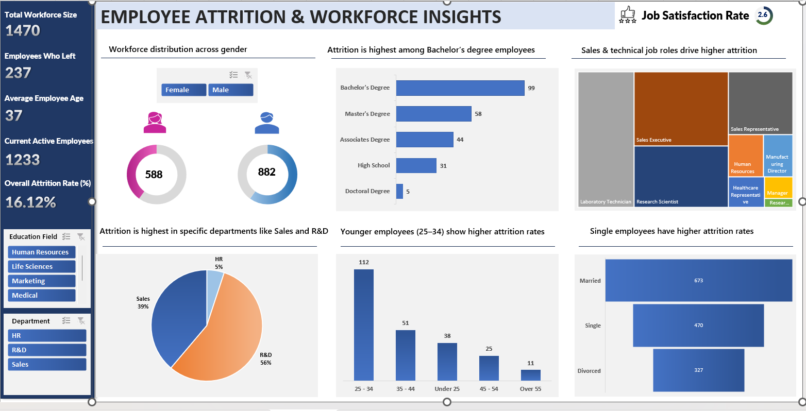

# 👥 Employee Attrition & Workforce Insights Dashboard

An interactive Excel dashboard analyzing employee attrition patterns, workforce demographics, and job satisfaction — built entirely in Microsoft Excel using Pivot Tables, Pivot Charts, and Slicers across 10 structured worksheets.

---

## 📊 Dashboard Preview



---

## 📌 Problem Statement

Employee attrition is one of the costliest challenges for any organization. HR teams struggle to identify:
- Which departments and roles have the highest attrition risk
- What demographic factors (age, education, marital status) drive employee exits
- How job satisfaction correlates with attrition
- Where to focus retention strategies for maximum impact

This dashboard transforms raw HR data into a clear, actionable workforce intelligence report — built entirely without any coding or BI tools.

---

## 🎯 Objectives

- Measure overall attrition rate and active vs exited employee split
- Identify which departments, job roles, and education levels drive highest attrition
- Analyze age group and marital status patterns in employee exits
- Track job satisfaction scores across the workforce
- Provide data-backed HR retention recommendations

---

## 📂 Dataset

| Detail | Info |
|--------|------|
| **Source** | [IBM HR Analytics Employee Attrition — Kaggle](https://www.kaggle.com/datasets/pavansubhasht/ibm-hr-analytics-attrition-dataset) |
| **Total Records** | 1,470 employees |
| **Columns** | 35 features |
| **Domain** | Human Resources Analytics |

**Key Fields:**
`Age` · `Attrition` · `Department` · `Education` · `EducationField` · `JobRole` · `MaritalStatus` · `MonthlyIncome` · `JobSatisfaction` · `YearsAtCompany` · `Gender`

---

## 🛠️ Tools & Excel Features Used

| Feature | Purpose |
|---------|---------|
| **Pivot Tables** | Summarizing attrition by department, age, education, marital status |
| **Pivot Charts** | Bar charts, donut charts, pie chart, treemap |
| **Slicers** | Interactive filters for Education Field and Department |
| **Excel Formulas** | `COUNTIF`, `IF`, `COUNTA`, `AVERAGE` |
| **Custom KPI Cards** | Workforce size, attrition count, active employees, rate % |

---

## 📋 Workbook Structure (10 Sheets)

| Sheet | Contents |
|-------|---------|
| **Data** | Raw IBM HR dataset — 1,470 employee records, 35 columns |
| **KPI** | Core KPI calculations — attrition rate, active count, avg age |
| **Gender** | Pivot analysis of gender distribution and attrition by gender |
| **Rating** | Job satisfaction score analysis across roles and departments |
| **Education by Attrition** | Attrition breakdown by education level (Bachelor's, Master's, etc.) |
| **Attrition by Job** | Job role-level attrition — Sales Rep, Executive, Scientist, etc. |
| **Dept wise Attrition** | Department share of attrition (R&D 56%, Sales 39%, HR 5%) |
| **Marital status** | Attrition patterns by marital status (Single, Married, Divorced) |
| **Attrition by Age group** | Age group breakdown (25–34 highest at 112 exits) |
| **Dashboard** | Final interactive dashboard with all visuals and slicers |

---

## 📈 Key KPIs

| KPI | Value |
|-----|-------|
| **Total Workforce Size** | 1,470 employees |
| **Employees Who Left** | 237 |
| **Current Active Employees** | 1,233 |
| **Overall Attrition Rate** | 16.12% |
| **Average Employee Age** | 37 years |
| **Job Satisfaction Rate** | 2.6 / 5 |

---

## 💡 Key Insights

- 📉 **Attrition rate is 16.12%** — 237 out of 1,470 employees left, above the healthy benchmark of 10–12%
- 🎓 **Bachelor's degree holders leave the most** — 99 exits, followed by Master's degree at 58
- 🏢 **R&D and Sales drive 95% of all attrition** — R&D at 56%, Sales at 39%; HR only 5%
- 👤 **Sales Representatives and Executives have highest role-level attrition** — visible in treemap
- 👶 **Employees aged 25–34 leave the most** — 112 exits vs only 11 for employees over 55
- 💍 **Single employees show higher attrition (470)** vs married (673) and divorced (327)
- 😔 **Job satisfaction is critically low at 2.6/5** — direct leading indicator of high attrition

---

## 🎨 Dashboard Visuals

| Visual | Insight Shown |
|--------|--------------|
| **KPI Cards** (left panel) | Total workforce, employees left, active count, attrition %, avg age |
| **Donut Charts** | Gender split — Female (588) vs Male (882) |
| **Horizontal Bar Chart** | Attrition by education level |
| **Treemap** | Attrition by job role |
| **Pie Chart** | Department attrition share |
| **Bar Chart** | Age group attrition |
| **Bar Chart** | Marital status vs employee count |
| **Slicers** | Education Field & Department interactive filters |

---

## 🔢 Key Excel Formulas Used

```excel
-- Attrition Rate
= COUNTIF(Attrition,"Yes") / COUNTA(Attrition)

-- Active Employees
= COUNTIF(Attrition,"No")

-- Average Age
= AVERAGE(Age)

-- Age Group Bucket
= IF([@Age]<=24,"Under 25",
  IF([@Age]<=34,"25-34",
  IF([@Age]<=44,"35-44",
  IF([@Age]<=54,"45-54","Over 55"))))
```

---

## 🏢 Business Recommendations

1. **Urgent intervention in R&D and Sales** — 95% of attrition is here; salary reviews and career growth paths needed immediately
2. **Early career retention programs** — 25–34 age group is the critical risk zone; mentorship and promotion tracks can reduce exits
3. **Address low job satisfaction (2.6/5)** — anonymous pulse surveys and manager training should be top priority
4. **Career clarity for Bachelor's degree employees** — structured laddering can retain the largest exit group
5. **Flexible work policies for single employees** — remote options and engagement programs can improve retention

---

## 📁 Repository Structure

```
hr-attrition-excel/
│
├── README.md                      ← Project documentation
├── dashboard.png                  ← Dashboard screenshot
└── HR_Attrition_Dashboard.xlsx    ← Full Excel workbook (10 sheets)
```

---

## 🚀 How to View

1. Download `HR_Attrition_Dashboard.xlsx` from this repo
2. Open with **Microsoft Excel 2016 or later**
3. Go to the **"Dashboard"** sheet tab to see the interactive dashboard
4. Use the **Education Field** and **Department** slicers to filter

---

## 👤 Author

**Abhin Gulam**
- 💼 [LinkedIn Profile](your-linkedin-url)
- 🐙 [GitHub](https://github.com/abhingulam)

---

`Excel` `HR Analytics` `Employee Attrition` `Pivot Tables` `Data Visualization` `Workforce Insights` `Dashboard` `No-Code Analytics` `Data Analytics Portfolio`
